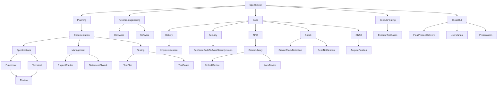

# Statement of work

## Introduction

The purpose of this document is to define the statement of work for the project. The statement of work is a document that defines the work that will be done in a project. It is a formal document that is used to define the project scope, deliverables, and timeline. The statement of work is an important document that helps to ensure that the project is completed on time and within budget.

## Project overview

The project is to develop an anti-theft device that can be used to secure sport equipement for the protoype we have is for winter sport like skiing and snowboarding but in the future it will be for a lot of different sport. The anti-theft device will be able to be unlock using a NFC card and will have a battery lifespan of seven days. The anti-theft device will also be able to manage all security issues and will have a shock detection feature. The user will be able to unlock the device with NFC and will the device be able to send a notification when a shock is detected via an app. The anti-theft device will also be able to acquire the GNSS position.

## Scope

The scope of the project is to develop an anti-theft device that can be used to secure sport equipment. The anti-theft device will have the following features:

- Battery lifespan of seven days
- Manage all security issues
- Shock detection
- Unlock the device with NFC
- Shock notification
- GNSS position acquisition

## Deliverables

The deliverables for the project are as follows:

- Final Product Delivery
- Functional Specifications Document
- Technical Specifications Document
- The Test Plan
- User Manual
- Source Code

## Timeline

The project will be completed by the 10th of April 2024 at 5pm.
To follow the progress of the timeline you can check the [task schedule](https://github.com/orgs/algosup/projects/25)

## Work Breakdown Structure(WBS)

The work breakdown structure for the project is as follows

## Conclusion

To conclude this statement of work, the project is to develop an anti-theft device that can be used to secure sport equipment. The anti-theft device will have a battery lifespan of seven days, manage all security issues, have a shock detection feature, unlock the device with NFC, send a shock notification, and acquire the GNSS position. The project will be completed by the 10th of April 2024 at 5pm.
