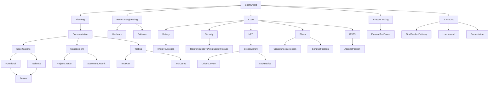

# Statement of work

## Introduction

The purpose of this document is to define the project specifications. The statement of work is a document that defines the work that will be carried out as part of a project. It is a formal document used to define the project scope, deliverables and schedule. The Statement of Work is an important document to ensure that the project is completed on time and on budget.

## Project Overview

The project involves developing an anti-theft device that can be used to secure sports equipment. The prototype we have is designed for winter sports such as skiing and snowboarding, but in the future it could be used for a large number of different sports. The anti-theft device can be unlocked using an NFC card, and its battery will last for seven days. The anti-theft device will also be able to handle all security issues and will have a shock detection function. Users will be able to unlock the device using an NFC card, and the device will be able to send a notification when a shock is detected via an app. The anti-theft device will also be able to acquire GNSS position.

## Scope

The aim of the project is to develop an anti-theft device that can be used to secure sports equipment. The anti-theft device will have the following characteristics

- Seven-day battery life
- Management of all security problems
- Shock detection
- Device unlocking via NFC
- Device locking via NFC
- Shock notification
- GNSS position acquisition

## Deliverables

The expected results of the project are as follows:

- Delivery of the final product
- Functional specifications document
- Technical specification document
- Management documents
- Test plan
- User manual
- Source code

## Schedule

The project will be completed on 10 April 2024 at 5pm.
To follow the progress of the schedule, you can consult the [task calendar](https://github.com/orgs/algosup/projects/25).

## Work Breakdown Structure (WBS)

The work breakdown structure for the project is as follows

## Conclusion

To conclude this statement of work, the project involves developing an anti-theft device that can be used to secure sports equipment. The anti-theft device will have a lifetime of seven days, manage all security issues, have a shock detection function, unlock the device with NFC, send a shock notification and acquire the GNSS position. The project will be completed on 10 April 2024 at 5pm.
