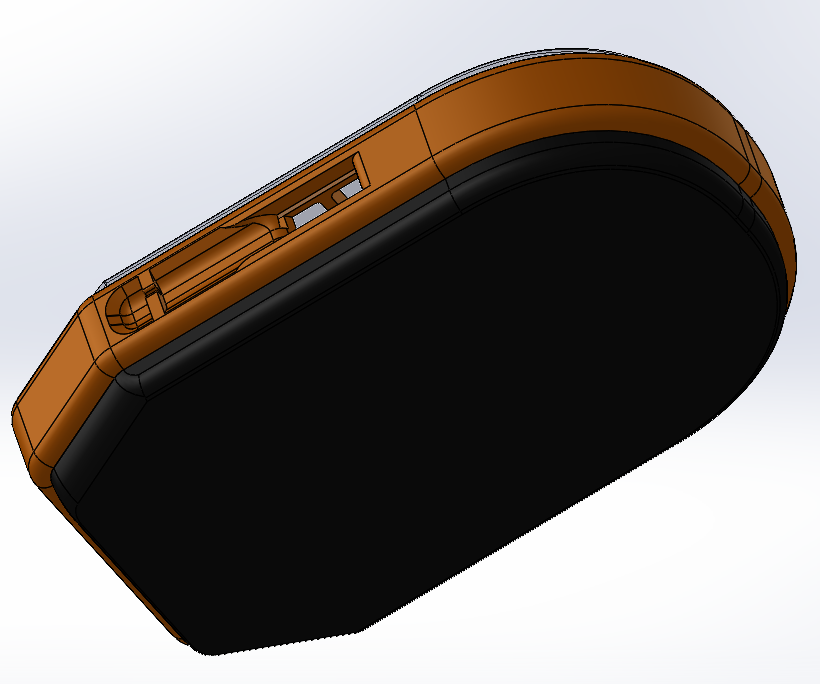

    

# 
 User manual 

# 
 Version 0.4 

Table of Contents

- [ User manual ](#-user-manual-)
- [ Version 0.4 ](#-version-04-)
- [Get Started](#get-started)
  - [What's in the box](#whats-in-the-box)
  - [Charge your SportShield](#charge-your-sportshield)
  - [Set up SportShield](#set-up-sportshield)
- [How to lock SportShield](#how-to-lock-sportshield)
- [How to unlock SportShield](#how-to-unlock-sportshield)
- [Alarm](#alarm)
- [App](#app)
- [Notifications](#notifications)
- [General Info and Specifications](#general-info-and-specifications)
  - [Components](#components)
  - [Robustness Assurance](#robustness-assurance)
    - [Anti-theft Cable](#anti-theft-cable)
  - [Environmental conditions](#environmental-conditions)
  - [Security](#security)

 

# Get Started

SportShield is an innovative anti-theft device designed for sports equipment, equipped with sensors and actuators to detect movement, activate an alarm, and notify the owner.
  
**SportShield is still in development. This prototype doesn't include yet all the features that we are planning to implement.**

## What's in the box

Your SportShield includes:
- An anti-theft SportShield device 

- This user manual

## Charge your SportShield

A fully-charged SportShield can last over 6 days.

To charge SportShield:

1. Plug the charger into the USB port on the SportShield. 

2. Plug the other end of the charger into an outlet.

 

The SportShield is now charging. Try to not use SportShield during its charging.

## Set up SportShield

To fully use the SportShield device, you'd need to set up few things with your smartphone.  
You can either set up by Bluetooth or with the SportShield app.   
By Bluetooth:
- Enable your Bluetooth connection on your phone.
- You should find a device named "SportShield". 

- Connect your smartphone with the device.  

  
  
Regarding the SportShield app, see the [dedicated manual part](#app).

 

The SportShield is now set up, you can use it whenever and wherever you want.

# How to lock SportShield 

The SportShield prevents your sport belongings from thiefs. Its installation deals with few steps:
1. Wind the cable from the cable exit of the SportShield device.
2. Surround your belongings with the cable.
3. Attach the cable to the cable holder.
 

If SportShield is not connected to your smartphone, refer to the [set up part](#set-up-sportshield).  
The SportShield is now locked and you won't be able to pull the cable anymore, if you don't unlock it. 
  
You'll receive a notification if the SportShield detects a shock. 

For more information about notifications, refer to the [dedicated manual part](#notifications).

 

# How to unlock SportShield 

SportShield's uninstallation is quite simple. You can unlock it either by Bluetooth or with the app. 
By Bluetooth:
1. Go on your Bluetooth settings. 

2. Click on the "Unlock" button to unlock SportShield.

 
The SportShield is now unlocked. The alarm won't ring and you can take your device back.

 

# Alarm

When the SportShield is locked, each detected shock will ring an alarm.  The alarm intensity depends on the shock intensity:  
- 3 light sounds when a light shock is detected.
- 5 long high sounds when a strong shock is detected.
 

Whenever the alarm rings, a notification is sent to the smartphone. 
For more information about notifications, refer to the [dedicated manual part](#notifications).
 

# App

The SportShield app would be available either on the Apple App Store and the Google Play Store. 
Even though, the app has not been synchronized with the SportShield device. In this user manual, you won't be able to find any useful information about this application.

# Notifications

The nofications contain some information about the device, such as the GPS coordinates (longitude lagitude) and the remaining battery percentage. 

# General Info and Specifications

## Components

Here's a list of the components a SportShield device contains:
- Xiao BLE Sense nrf52840
- GNSS PA1010D
- GSM/2G SIM800L Module
- Electromagnet
- Piezoelectric Buzzer
- Lithium-Polymer Battery
- NFC Antenna

## Robustness Assurance

Since the SportShield is an anti-theft device, it has to be resistant enough, meeting some resistance criteria.
<!-- Waterproofness, cold-resistance, and robustness against break-in attempts. -->

### Anti-theft Cable

**The cable in itself got some adjustments to meet the resistance criteria.** 
For physical security, a multi-layered cable and electromagnetic lock have been implemented. 
Moreover, the cable automatically retracts into the housing and prevents unwinding when locked.

## Environmental conditions

<!-- 3 days autonomy in ambient environment (60% more consumption in cold environment) -->

## Security

SportShield prioritizes the fundamental principles encapsulated within the AIC triad: Confidentiality, Integrity, and Availability.

Confidentiality, akin to the notion of privacy, serves as the bedrock of SportShield's approach to safeguarding sensitive information. By meticulously categorizing data based on its potential impact if compromised, SportShield enforces stringent measures to thwart unauthorized access attempts, ensuring that confidential data remains secure and inaccessible to unauthorized entities.

Integrity stands as a pillar of trustworthiness within SportShield's framework. Throughout the lifecycle of data, from creation to dissemination, SportShield employs robust mechanisms to uphold the consistency and accuracy of information. By fortifying data against unauthorized alterations, such as those that might occur during data breaches or in transit, SportShield guarantees the integrity of critical information.

Availability, the third facet of the AIC triad, underscores SportShield's commitment to ensuring that authorized parties can access information promptly and consistently. Through diligent maintenance of hardware, technical infrastructure, and systems, SportShield endeavors to eliminate downtime and disruptions, thereby enabling seamless access to vital data whenever and wherever it is needed.

©2015-2024 Coris Innovation. All rights reserved. Coris Innovation and the Coris Innovation logo are trademarks or registered trademarks of Coris Innovation