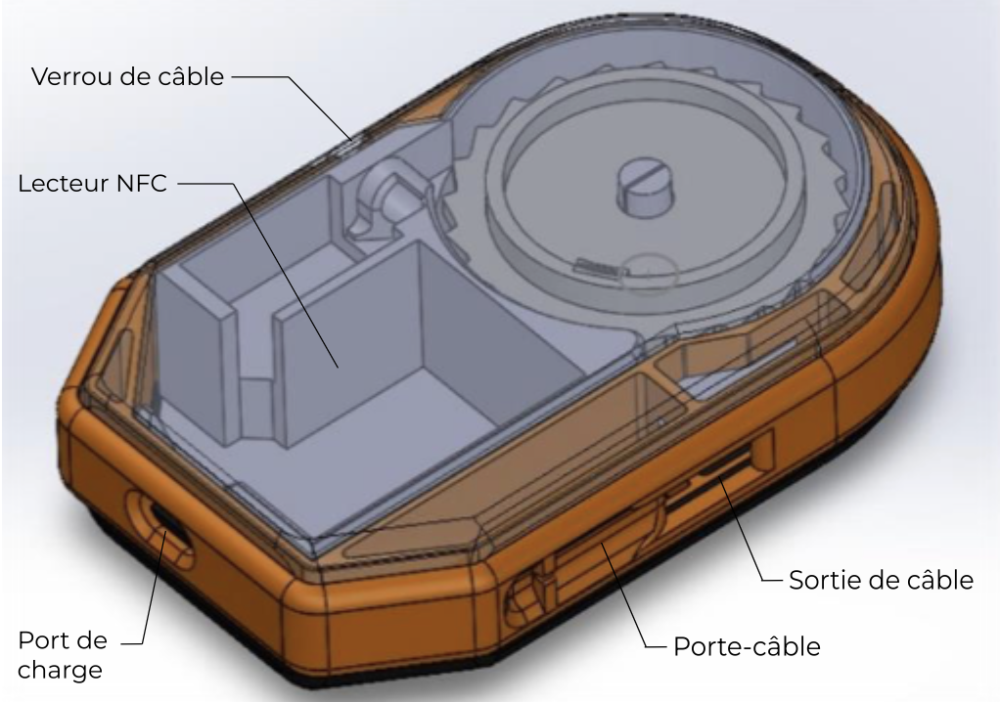
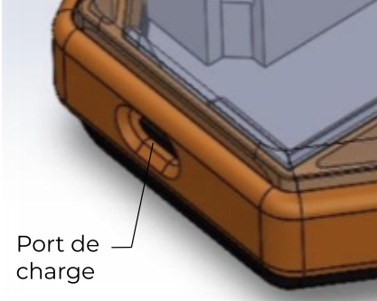
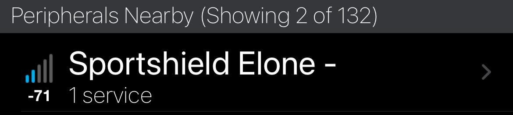
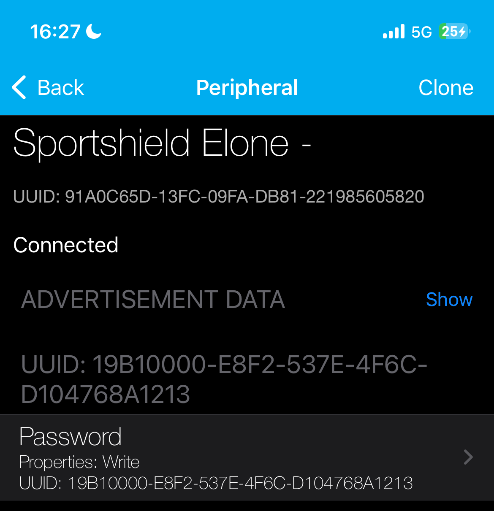
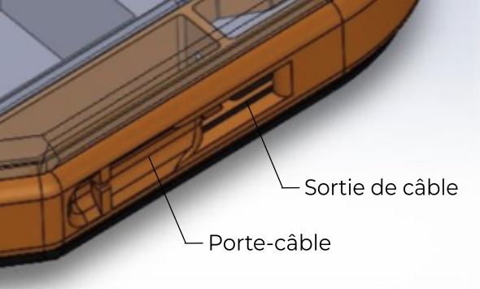
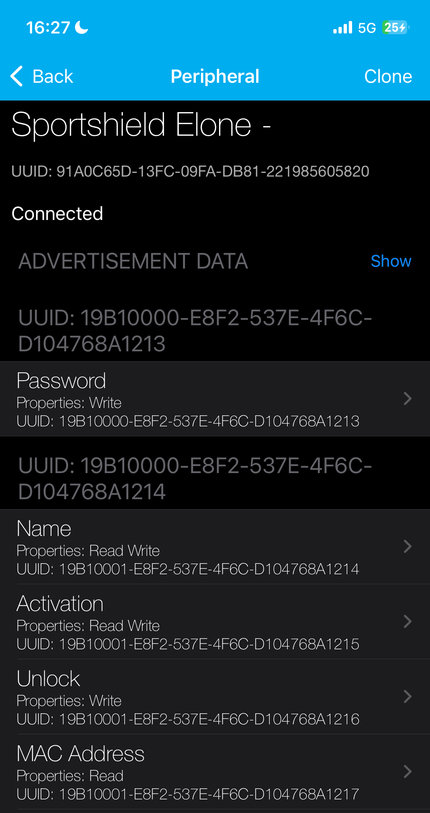
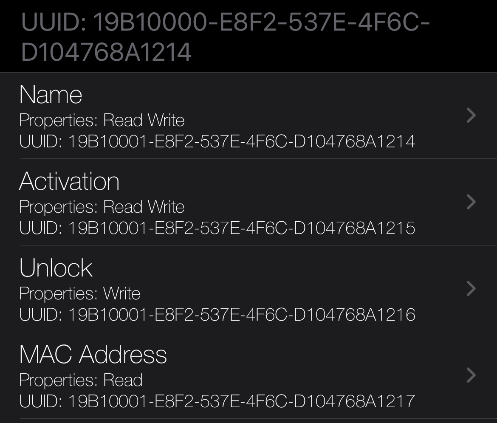
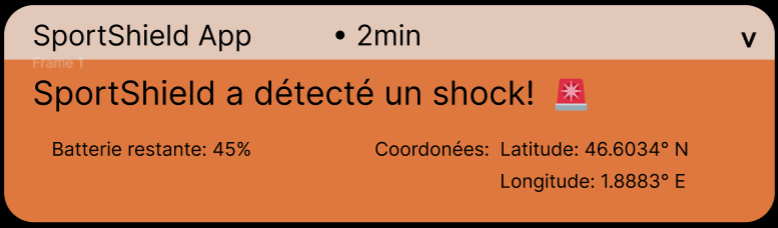

    

# 
 Mode d'emploi 

# 
 Version 1.1 

Sommaire

- [ Mode d'emploi ](#-mode-demploi-)
- [ Version 1.1 ](#-version-11-)
- [Mesures de sécurité](#mesures-de-sécurité)
  - [Avertissements](#avertissements)
- [Premières Etapes](#premières-etapes)
  - [Contenu de la boîte](#contenu-de-la-boîte)
  - [Chargez votre SportShield](#chargez-votre-sportshield)
  - [Initialisation de votre SportShield](#initialisation-de-votre-sportshield)
- [Comment verrouiller votre SportShield](#comment-verrouiller-votre-sportshield)
- [Comment déverrouiller votre SportShield](#comment-déverrouiller-votre-sportshield)
- [Alarme](#alarme)
- [App](#app)
- [Notifications](#notifications)
- [Informations Générales and Spécifications techniques](#informations-générales-and-spécifications-techniques)
  - [Composants](#composants)
  - [Garantie de robustesse](#garantie-de-robustesse)
    - [Câble d'antivol](#câble-dantivol)
  - [Conditions environnementales](#conditions-environnementales)
  - [Sécurité](#sécurité)
  - [Glossaire](#glossaire)

 

# Mesures de sécurité

> ⚠️ ATTENTION • Avant utilisation, lisez le mode d'emploi pour vous assurer d'une utilisation correcte et d'une bonne compréhension. Après lecture, conservez-le dans un endroit sûr pour pouvoir vous y référer ultérieurement. Une mauvaise manipulation de ce produit peut entraîner des blessures ou des dommages physiques. Le fabricant n'assume aucune responsabilité pour tout dommage causé par une mauvaise manipulation dépassant l'utilisation normale définie dans ce manuel.

## Avertissements

- <h3> Ne jamais démonter ou modifier, la modification et/ou le désassemblage du produit peut entraîner un choc électrique ou tout autre type de blessure.</h3>

- <h3> Faire preuve d'une prudence particulière à l'égard des enfants et des animaux domestiques, notamment dans les foyers où ils sont présents.</h3>

- <h3> Soyez prudent lorsque vous chargez l'appareil, vous risquez de provoquer un incendie ou un choc électrique. N'appliquez pas trop de chaleur, de pression ou de tension au cordon d'alimentation.</h3>

- <h3> Ne fixez rien d'autre que les éléments spécifiés à l'appareil, toute négligence pourrait entraîner des blessures ou des dommages.</h3>

# Premières Etapes

SportShield est un dispositif antivol innovant conçu pour les équipements sportifs, équipé de capteurs et d'actionneurs qui détectent les mouvements, déclenchent une alarme et avertissent le propriétaire.
  
**SportShield est encore en cours de développement. Ce prototype n'inclut pas encore toutes les fonctionnalités que nous prévoyons d'implémenter.**

## Contenu de la boîte

Votre SportShield inclut:

- Un dispositif antivol SportShield 

- Un chargeur
- Ce mode d'emploi

## Chargez votre SportShield

Si l'appareil SportShield est à court de batterie, il ne fonctionnera plus jusqu'à ce qu'il soit rechargé.  
Un SportShield entièrement chargé peut durer plus de 6 jours.

Pour charger votre SportShield:

1. Branchez le chargeur dans le port USB sur le SportShield. 

2. Branchez l'autre bout du chargeur dans la prise.

 

SportShield est en train de charger.  
**ATTENTION:** Ne pas utiliser SportShield pendant qu'il charge.

## Initialisation de votre SportShield

Pour utiliser pleinement le dispositif SportShield, vous aurez besoin d'initialiser quelques points avec votre smartphone.  
Vous pouvez le faire soit par Bluetooth, avec une carte NFC ou avec l'appli SportShield.   
Par Bluetooth:

- Activez votre connection Bluetooth sur votre smartphone.
- Vous devrez trouver un dispositif nommé "SportShield". 

- Connectez votre smartphone avec le dispositif.  

  
  
Avec une carte NFC:

- Rentrez la carte NFC en contact avec votre SportShield.

A propos de l'appli SportShield, regardez la [partie dédiée](#app).

 

SportShield est maintenant initialisé, vous pouvez l'utiliser quand et où vous voulez.

# Comment verrouiller votre SportShield

SportShield protège vos affaires de sport contre les voleurs. Son installation n'a que quelques étapes:

1. Tirez le câble de la sortie de câble du SportShield.
2. Entourez vos affaires avec le câble.
3. Attachez le câble au porte-câble. 

Si SportShield n'est pas connecté à votre smartphone ou avec une carte NFC, le dispositif ne fonctionnera pas comme prévu. 
Référez-vous à [partie initialisation](#initialisation-de-votre-sportshield).  
SportShield est maintenant verrouillé et vous ne pourrez plus tirer sur le câble si vous ne le déverrouillez pas.   
Vous recevrez une notification si le SportShield détecte un choc.  
Pour plus d'informations sur les notifications, reportez-vous à la [section dédiée](#notifications).

# Comment déverrouiller votre SportShield

Le déverrouillage de SportShield est plutôt simple. Vous pouvez le déverrouiller par Bluetooth ou à l'aide de l'application.  
Par Bluetooth:

1. Allez dans vos paramètres Bluetooth. 

2. Cliquez sur le bouton "Unlock" pour déverrouiller le SportShield. 

Avec une carte NFC:

- Rentrez la carte NFC en contact avec votre SportShield.

A propos de l'app SportShield, reportez-vous à la [section dédiée](#app).

 
SportShield est maintenant déverrouillé. L'alarme ne sonnera pas et vous pouvez reprendre le dispositif.

 

# Alarme

Quand votre SportShield est verrouillé, chaque choc détecté sonnera une alarme.  L'intensité de l'alarme dépend de l'intensité du choc:  

- 3 sons légers lorsqu'un choc léger est détecté.
  
- 5 sons longs et aigus lorsqu'un choc important est détecté.
  

De plus, vous pouvez arrêter l'alarme quand vous le souhaitez. Pour ce faire, vous pouvez utiliser le Bluetooth ou l'application.  

Par Bluetooth: ce sont les mêmes étapes que le [verrouillage du SportShield](#comment-verrouiller-votre-sportshield).

Avec une carte NFC, ce sont les mêmes étapes que le [déverrouillage du SportShield](#comment-déverrouiller-votre-sportshield).

A propos de l'application SportShield, reportez-vous à la [partie dédiée](#app).

Quand l'alarme sonne, une notification est envoyé au smartphone appareillé. 
Pour plus d'informations sur les notifications, reportez-vous à la [section dédiée](#notifications).
 

# App

L'application SportShield sera disponible sur l'Apple App Store et le Google Play Store. 
L'application n'a pas encore été synchronisée avec l'appareil SportShield.   Dans ce manuel, vous ne trouverez pas pour le moment d'informations utiles sur cette application.

  

# Notifications

Aucune application n'ayant été synchronisée avec le dispositif SportShield, la simulation mise en œuvre reproduit parfaitement son fonctionnement.  

Les notifications contiennent des informations sur l'appareil, telles que les coordonnées GPS (longitude, latitude) et le pourcentage de batterie restant. 

# Informations Générales and Spécifications techniques

## Composants

Voici une liste des composants d'un appareil SportShield :

- Xiao BLE Sense nrf52840
- GNSS PA1010D
- GSM/2G SIM800L Module
- Electro-aimant
- Alarme Piezoelectric
- Batterie Lithium-Polymer
- Antenne NFC

## Garantie de robustesse

Le SportShield étant un dispositif antivol, il est censé être suffisamment résistant et répondre à certains critères de résistance.

**Étanchéité** : Le SportShield est censé être étanche à l'eau et répondre aux indices de protection IP65, 66 ou 67.

**Résistance au froid** : SportShield est censé être résistant au froid et répondre aux critères TCR de 0 à 50 ppm/°C.

**Résistance à la chaleur** : SportShield est censé être résistant à la chaleur et répondre à des valeurs TCR comprises entre 100 et 500 ppm/°C.

**Robustesse** : SportShield est censé être suffisamment résistant aux tentatives d'effraction.

### Câble d'antivol

**Le câble lui-même a fait l'objet de quelques ajustements pour répondre aux critères de résistance.**  
Pour la sécurité physique, un câble multicouche et une serrure électromagnétique ont été mis en place. 
De plus, le câble se rétracte automatiquement dans le boîtier et ne se déroule pas lorsqu'il est verrouillé.

## Conditions environnementales

SportShield devrait avoir une autonomie de 6 jours en milieu ambiant.  
Cependant, dans un environnement froid, l'appareil peut consommer 60% plus rapidement que d'habitude (ce qui représente 3 jours et 12 heures).

## Sécurité

SportShield donne la priorité aux principes fondamentaux que sont la confidentialité et l'intégrité.

En classant méticuleusement les données en fonction de leur impact potentiel en cas de compromission, SportShield applique des mesures strictes pour contrecarrer les tentatives d'accès non autorisé, garantissant ainsi que les données confidentielles restent sécurisées et inaccessibles aux entités non autorisées.

En protégeant les données contre les altérations non autorisées, comme dans le cas où un voleur voudrait corrompre votre appareil SportShield, SportShield garantit l'intégrité des informations critiques.

  

## Glossaire

Une **carte à communication en champ proche (NFC)** est un type de carte à puce équipée de la technologie NFC. Elle contient une puce NFC intégrée qui lui permet de communiquer sans fil avec des dispositifs compatibles NFC, tels que les smartphones, les terminaux d'identification et de paiement, sur de courtes distances (généralement quelques centimètres).

Un **câble multicouche** est un type de câble électrique composé de plusieurs couches de matériaux différents, chacune ayant une fonction spécifique. Ces câbles sont couramment utilisés dans diverses applications où des caractéristiques de performance spécifiques sont requises.

Une **serrure électromagnétique**, également connue sous le nom de "maglock", est un type de dispositif de verrouillage couramment utilisé dans les systèmes de contrôle d'accès pour sécuriser les portes et les portails. Elle se compose d'un électro-aimant et d'une plaque d'armature. Lorsque l'électro-aimant est alimenté, il génère un champ magnétique qui attire et retient la plaque d'armature, verrouillant ainsi le dispositif en toute sécurité.

L'**indice de protection IP** est un système de classification standard utilisé pour définir le degré de protection d'un boîtier contre l'intrusion d'objets solides tels que la poussière et l'eau. Plus l'indice IP est élevé, plus la protection contre la pénétration de solides et de liquides est importante.

Le **coefficient de résistance à la température (TCR)** est une mesure de l'évolution de la résistance électrique d'un matériau en fonction de la température. Le TCR est généralement exprimé en parties par million par degré Celsius (ppm/°C) ou par Kelvin (ppm/K). Dans le contexte de la résistance au froid, les matériaux à faible TCR sont souhaitables. Inversement, dans le contexte de la résistance à la chaleur, les matériaux ayant des indices TCR plus élevés peuvent être plus appropriés.

Ce guide est fourni à titre de référence uniquement. Le produit réel, y compris la couleur, la taille et la disposition de l'écran, peut différer. Les déclarations, informations et recommandations contenues dans ce guide ne constituent pas une garantie, expresse ou implicite.
  
©2015-2024 Coris Innovation. Tous droits réservés. Coris Innovation et le logo Coris Innovation sont des marques commerciales ou des marques déposées de Coris Innovation.

  

    

